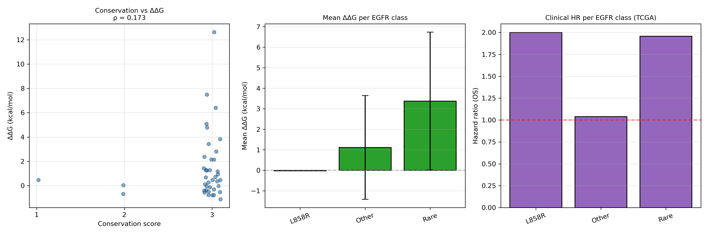
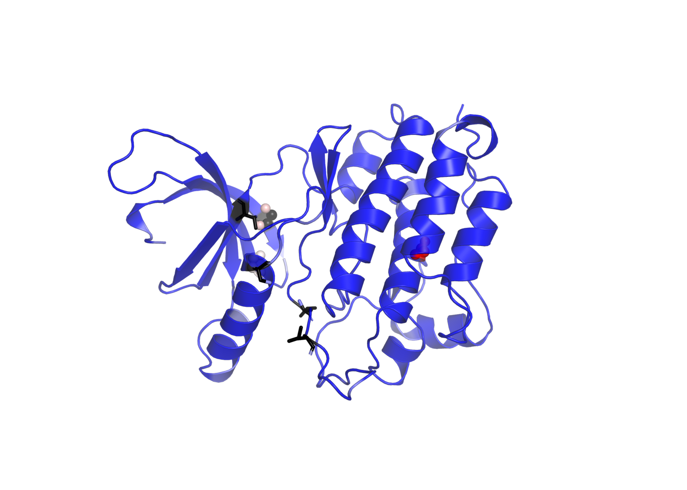
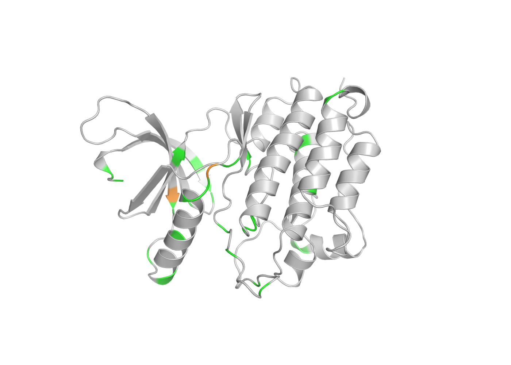
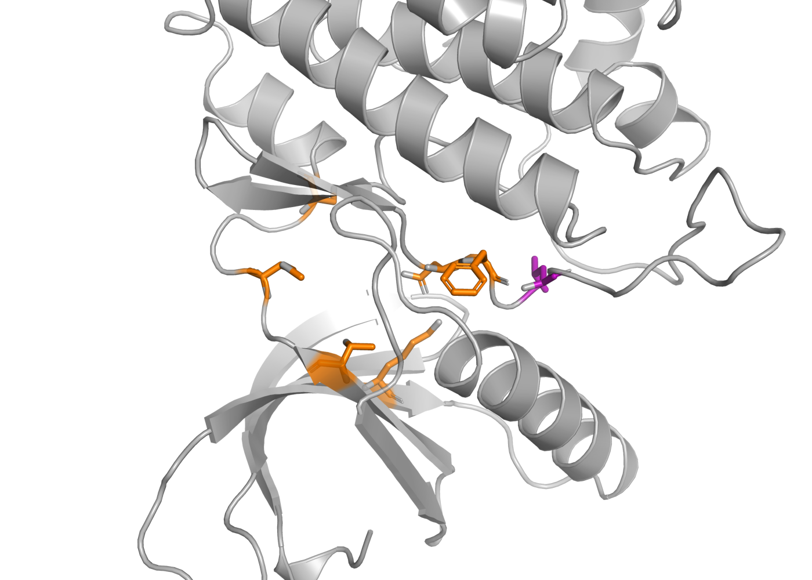
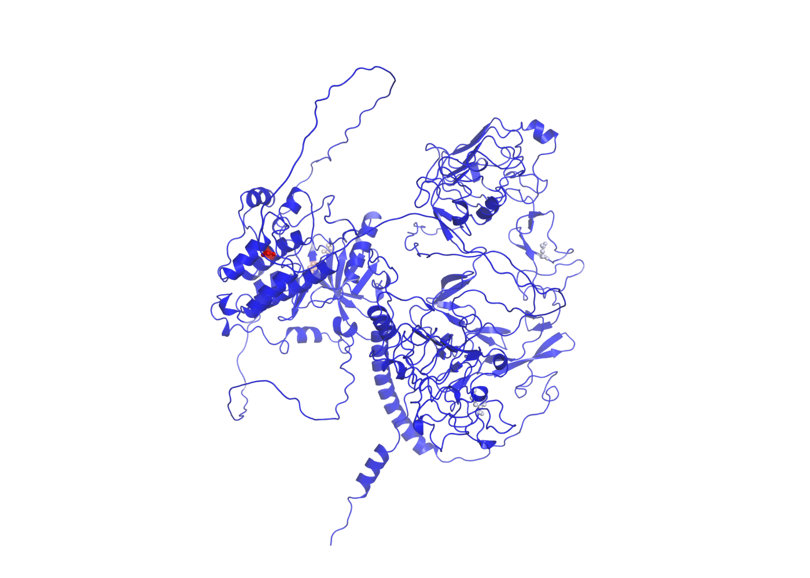

# EGFR Variant Structural Analysis

**A three-layer analysis of LUAD EGFR variants: evolutionary conservation, structural stability, and clinical outcome.**

---

## Motivation

Clinical interpretation of EGFR variants in lung adenocarcinoma usually
relies on population frequency and clinical annotation. Two additional
layers of evidence exist but are rarely integrated:

1. **Evolutionary conservation** — Project 2 (erbb-phylogenomics) produced
   codon-aware conservation scores for every ErbB alignment column across
   five vertebrate species.
2. **Clinical outcome** — Project 3 (EGFR-NSCLC-Clinical-Survival-Analysis)
   produced hazard ratios for EGFR variant classes in TCGA-LUAD and OncoSG.

Neither analysis asked where the variants physically sit in the protein, or
whether structural destabilisation correlates with either layer.

This project adds the structural dimension and then asks whether the three
layers agree.

---

## Key Finding

**The three layers do not agree.** Across 40 LUAD EGFR substitutions:

| Layers compared | Spearman ρ | p | n |
|-----------------|-----------|---|-----|
| Conservation score vs FoldX ΔΔG | 0.17 | 0.29 | 40 |
| Mean class ΔΔG vs clinical HR | −0.50 | 0.67 | 3 |

Conservation and structural stability are **orthogonal axes of variant impact**.
Neither predicts the other. The clinically worst variant in the cohort — L858R,
HR 2.00 in TCGA-LUAD — is structurally neutral (ΔΔG = −0.03 kcal/mol).

That means variant interpretation cannot be reduced to a single scoring
system. A position can be deeply conserved across 700 million years of
vertebrate evolution without its substitution being thermodynamically
costly, and a variant can destabilise the protein without affecting
clinical outcome. Each layer carries independent information.

---

*Left: conservation vs ΔΔG across 40 substitutions (ρ = 0.17, n = 40).
Center: mean ΔΔG per EGFR class. Right: clinical HR per class (TCGA-LUAD).
The three panels do not move together — that is the finding.*

## Pipeline

| Phase | What | Output |
|-------|------|--------|
| **1** | Structure acquisition (AlphaFold v6 + experimental PDB) | 6 PDB files |
| **2** | Variant-to-residue mapping + conservation scoring | 66 variants mapped |
| **3** | Structural features + FoldX ΔΔG | Master table with all layers |
| **4** | Three-layer correlation | Scatter plots + Spearman ρ |
| **5** | PyMOL structural figures | 4 rendered PNGs |
| **6** | Writeup | This README |

### Phase 2 in more detail

Variants from Project 3's TCGA-LUAD and OncoSG cohorts (86 + 162 mutation
records) were deduplicated to 66 unique protein changes. Each HGVS string
was parsed to extract the affected residue numbers, then mapped onto the
human EGFR UniProt P00533 canonical numbering.

Conservation scoring used the 17-taxon codon alignment from Project 2.
Codons were translated to amino acids before comparison, so synonymous
codon differences do not count as mismatches. A variant's conservation
score is the number of vertebrate orthologs (human, mouse, chicken,
zebrafish) sharing the human amino acid at that residue — 3 = all four,
2 = three, 1 = one or two, 0 = none.

**Of the 66 variants mapped, 58 (88%) fall at positions invariant across
all four vertebrate orthologs.** That is expected — clinically observed
mutations concentrate in conserved functional domains.

### Phase 3 in more detail

Structural features per residue: domain assignment, SASA (Shrake-Rupley on
the AlphaFold model), distance to the ATP binding site (residues 745, 790,
793, 797, 855, 856), and distance to the allosteric pocket from Project 1
(residues 745, 856, 858).

FoldX 5.1 `BuildModel` produced ΔΔG for the 40 substitutions (deletions and
insertions are not handled by FoldX). Three runs per mutation; all 40
converged (run-to-run standard deviation < 1.0 kcal/mol for every mutation).

**The FoldX RepairPDB step did not produce a repaired PDB with version 5.1,
so BuildModel ran on the un-repaired AlphaFold model.** AlphaFold structures
are typically well-relaxed, so relative ΔΔG ranking remains meaningful, but
absolute values carry additional noise. This is reflected in the
run-to-run standard deviation reported in the ΔΔG table.

### Phase 4 in more detail

Per-variant correlation between conservation score and ΔΔG was tested with
Spearman's ρ. Class-level correlation between mean ΔΔG and clinical HR used
the four EGFR classes from Project 3 (Exon19del, L858R, Other, Rare).

The class-level analysis has n = 3 (Exon19del was not in the FoldX subset
because it is a deletion), so those correlations are uninformative and are
reported for completeness only.

---

## Reading the FoldX ΔΔG Values

FoldX returns ΔΔG in kcal/mol (mutant minus wildtype). Positive values mean
the mutation is destabilising. The distribution across 40 substitutions:

| Statistic | Value (kcal/mol) |
|-----------|------------------|
| Mean | +1.43 |
| Median | +0.47 |
| Std | 2.72 |
| Min | −1.12 |
| Max | +12.63 |
| Destabilising (>1) | 16 of 40 |
| Stabilising (<−1) | 1 of 40 |

The right-skewed distribution is expected: most substitutions are near-neutral,
but a small set of core mutations are highly destabilising.

## Structural Views

### Kinase domain colored by ΔΔG

*AlphaFold EGFR kinase domain (residues 707–982). Grey cartoon, red
spheres mark residues with ΔΔG > 3 kcal/mol. Black sticks mark
L858R, T790M, G719X, L861Q, S768I. The P-loop at 719–724 is the
concentrated destabilisation hotspot.*

### Kinase domain colored by conservation

*Same view, colored by conservation score. Green = invariant across
all four vertebrate orthologs; orange = score 2; red = score 1. The
domain is almost uniformly green because 88% of clinical variants
fall at conserved positions.*

### ATP site and allosteric pocket

*Orange sticks: ATP-binding residues (K745, T790, M793, C797, D855, F856).
Purple: L858 — the allosteric pocket residue from Project 1. T790 sits
directly in the ATP pocket (why T790M blocks drug binding); L858 sits
3.3 Å away (why L858R affects allostery without touching ATP).*

### Notable variants

| Variant | Residue | ΔΔG | Interpretation |
|---------|---------|------|----------------|
| G901V | 901 | +12.63 | Buried core glycine — likely lethal to the protein |
| G719S | 719 | +7.48 | P-loop glycine substitution |
| G719C | 719 | +6.41 | P-loop glycine substitution |
| G724A | 724 | +5.08 | Second P-loop glycine |
| G719A | 719 | +4.78 | P-loop glycine substitution |
| L858R | 858 | −0.03 | Structurally neutral |
| T790M | 790 | −1.12 | **Most stabilising mutation in the cohort** |

**Four of the top five most destabilising variants are P-loop glycines.**
The P-loop (residues 719–724 in EGFR) coordinates ATP phosphates. Glycine is
the only residue whose lack of a side chain fits the tight turn geometry. Any
substitution introduces steric clash. This matches the clinical observation
that G719X patients respond poorly to first- and second-generation TKIs.

**T790M is the most stabilising mutation.** Methionine fills the small
gatekeeper pocket more efficiently than threonine. The substitution makes
the protein slightly *more* stable — which is exactly why T790M emerges
under drug selection: it survives and blocks drug binding without
penalising the protein. FoldX recovered this from structure alone.

---

## Repository Structure

    egfr-variant-structural-analysis/
    |-- README.md
    |-- LICENSE
    |-- environment_struct.yml
    |-- .gitignore
    |-- data/
    |   |-- structures/         # AlphaFold v6 + PDB downloads
    |   |   |-- alphafold_EGFR_P00533.pdb
    |   |   |-- alphafold_HER2_P04626.pdb
    |   |   |-- 1M17.pdb, 3POZ.pdb, 5D41.pdb, 3PP0.pdb
    |   |   |-- alphafold_EGFR_with_ddg.pdb
    |   |   +-- alphafold_EGFR_with_conservation.pdb
    |   |-- variants/
    |   |   |-- luad_egfr_variants_raw.tsv
    |   |   |-- luad_egfr_variants_mapped.tsv
    |   |   |-- luad_egfr_variants_with_conservation.tsv
    |   |   |-- luad_egfr_variants_complete.tsv
    |   |   |-- features_structural.tsv
    |   |   +-- luad_egfr_variants_master.tsv
    |   +-- foldx/                # gitignored (binary + intermediates)
    |-- figures/
    |   |-- phase4_conservation_vs_ddg.png
    |   |-- phase4_class_ddg_vs_hr.png
    |   |-- phase4_class_summary.png
    |   |-- pymol_full_length_ddg.png
    |   |-- pymol_kinase_ddg.png
    |   |-- pymol_kinase_conservation.png
    |   +-- pymol_atp_allosteric.png
    |-- results/
    |   |-- phase4_correlations.tsv
    |   +-- phase4_class_table.tsv
    |-- scripts/
    |   |-- 01_map_variants.py
    |   |-- 02_compute_features.py
    |   |-- 03_parse_ddg.py
    |   |-- 04_merge_features.py
    |   |-- 05_three_layer_analysis.py
    |   |-- 06_prepare_pymol_input.py
    |   +-- 07_render_pymol_figures.py
    +-- tools/                    # gitignored (FoldX binary)

---

## Reproducibility

    conda create -n egfr_struct python=3.10 -y
    conda activate egfr_struct
    conda install -c conda-forge -c bioconda \
      biopython biotite pymol-open-source requests pandas \
      numpy matplotlib scipy -y

    # Fetch structures
    curl -L -o data/structures/alphafold_EGFR_P00533.pdb \
      "https://alphafold.ebi.ac.uk/files/AF-P00533-F1-model_v6.pdb"
    curl -L -o data/structures/alphafold_HER2_P04626.pdb \
      "https://alphafold.ebi.ac.uk/files/AF-P04626-F1-model_v6.pdb"

    # Phase 2
    python scripts/01_map_variants.py

    # Phase 3
    python scripts/02_compute_features.py
    # FoldX: download from foldxsuite.crg.eu (academic license), install to tools/
    # then generate individual_list.txt and run BuildModel (see scripts 03/04)
    python scripts/03_parse_ddg.py
    python scripts/04_merge_features.py

    # Phase 4
    python scripts/05_three_layer_analysis.py

    # Phase 5
    python scripts/06_prepare_pymol_input.py
    pymol -cq scripts/07_render_pymol_figures.py

The FoldX binary and its working directory are excluded from git (see
`.gitignore`). The downloaded binary is 86 MB and is not redistributable
under the FoldX academic license.

---

## Software

- **Structure handling**: Biopython, Biotite, PyMOL 3.x
- **Mutagenesis**: FoldX 5.1
- **Analysis**: Python 3.10, pandas, NumPy, SciPy
- **Rendering**: PyMOL (ray-traced PNG output)

---

## Limitations

**The FoldX repair step failed.** FoldX 5.1 `RepairPDB` produced an energy
report but no repaired PDB file, so `BuildModel` was run on the un-repaired
AlphaFold model. AlphaFold structures are generally well-minimised, so the
relative ΔΔG ranking is meaningful, but absolute values carry additional
noise. All runs converged (std < 1.0), which suggests the noise is not
large enough to change the ranking.

**Class-level correlations are underpowered.** The clinical HR from
Project 3 is class-level, not per-variant. Only three classes had ΔΔG data
(Exon19del is a deletion and is not modelled by FoldX). The Spearman ρ
between class ΔΔG and HR uses n = 3 and is not interpretable.

**Deletions and insertions are not modelled.** FoldX `BuildModel` handles
only point substitutions. This excludes Exon 19 deletions and Exon 20
insertions — two clinically important EGFR classes — from the ΔΔG analysis.

**Conservation scores use four vertebrate species.** Human, mouse, chicken,
zebrafish. Drosophila was excluded from the primary score because its
divergence is too large to distinguish meaningful conservation from
saturation. Adding amphibian or reptile taxa would sharpen the conservation
signal.

**SASA is computed on a single AlphaFold conformer.** SASA values are
conformer-dependent. The AlphaFold model is a single static snapshot; real
kinase domains sample multiple conformations. SASA-based interpretation
should be treated as approximate.

**No experimental validation.** Every value here is computational. ΔΔG is a
model output, not a measured free energy. Experimental assays (thermal
shift, CD spectroscopy) would be required to validate specific predictions.

---

## How This Connects to Other Projects

This is the fourth project in a portfolio focused on EGFR/ErbB:

| # | Project | Layer |
|---|---------|-------|
| 1 | EGFR allosteric inhibitor discovery | Structure (druggable pocket) |
| 2 | ErbB family comparative phylogenomics | Evolution (conservation) |
| 3 | LUAD EGFR clinical survival analysis | Clinical (patient outcome) |
| 4 | **This project** | **Integration of all three** |

Together, the four projects investigate EGFR from structure, evolution, and
clinical outcome, and then test whether the three perspectives agree.

---
### Full-length EGFR colored by ΔΔG

*Full-length human EGFR (UniProt P00533, 1,210 residues). Red spheres
mark residues with ΔΔG > 3 kcal/mol. The extracellular domain is largely
unaffected; the kinase core holds the destabilising substitutions.*

## Author

**Preet Beniwal** — Independent bioinformatics portfolio project.
GitHub: [@preet-beniwal](https://github.com/preet-beniwal)

---

## License

MIT — see [LICENSE](LICENSE).
